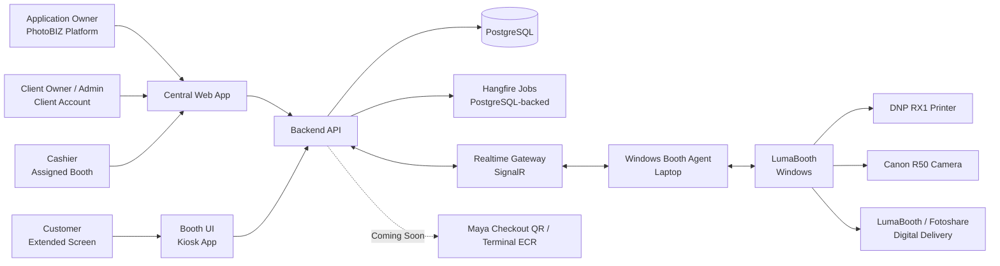
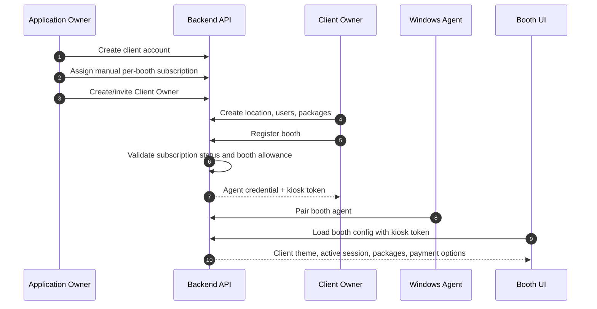
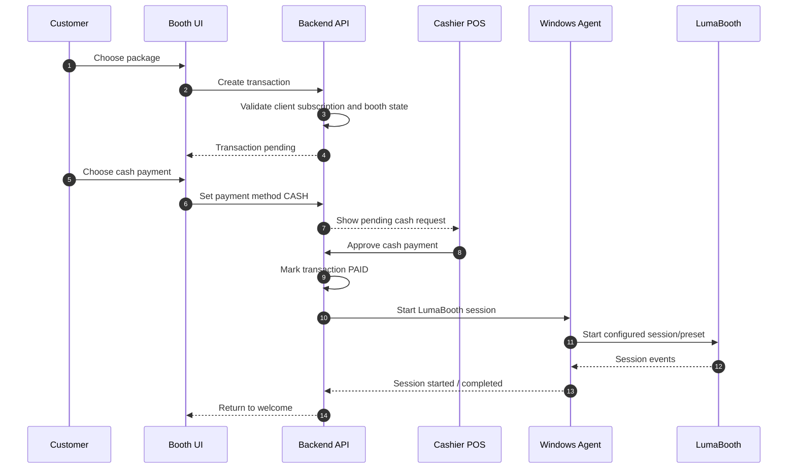
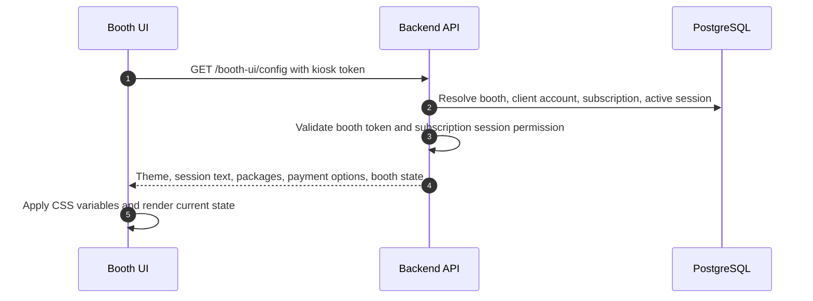
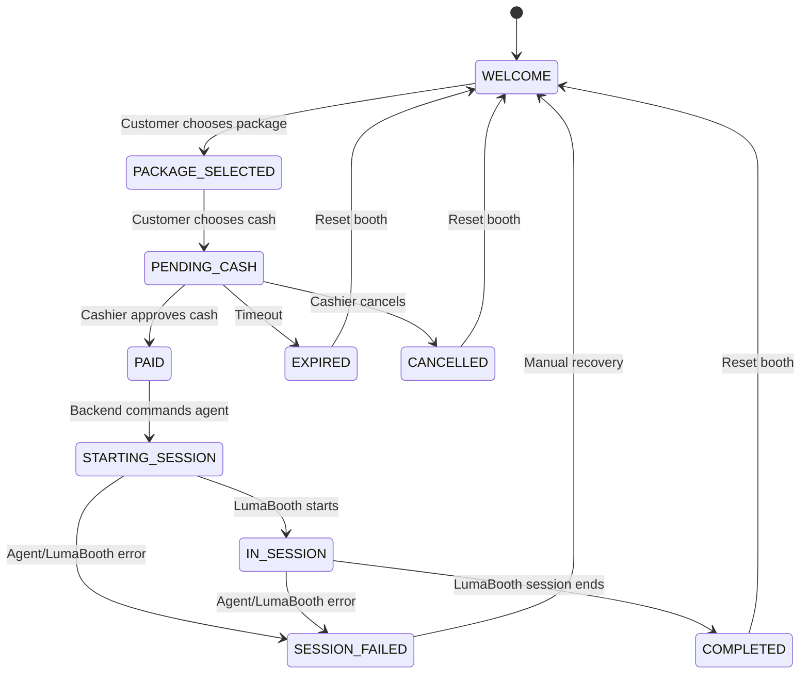
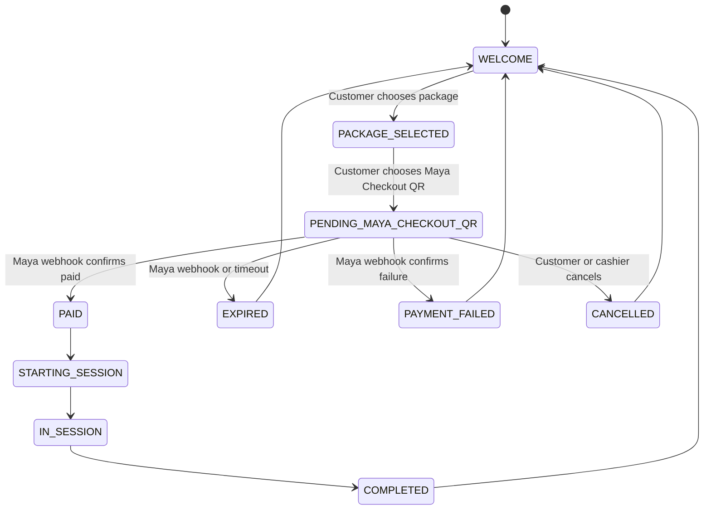
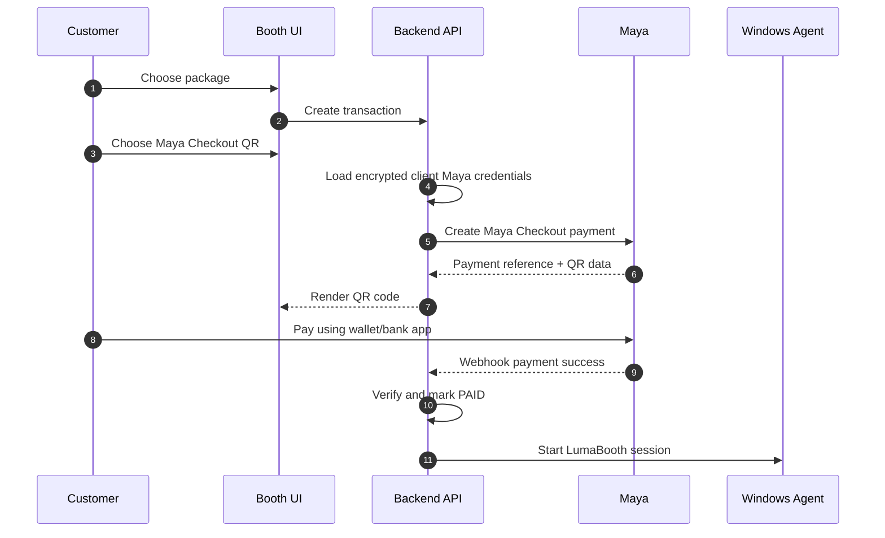
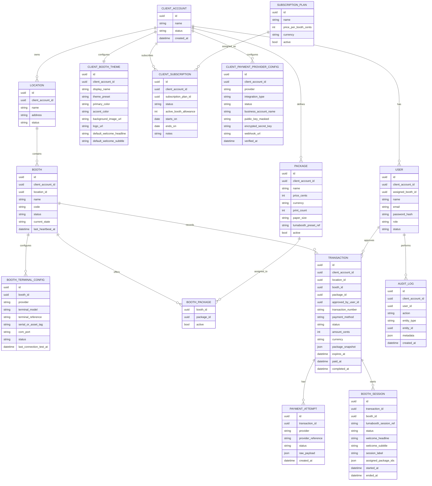

# Architecture And Diagrams

## Overview

This document is the source of truth for the PhotoBIZ platform architecture. Future implementation work must follow the decisions, boundaries, state machines, and phases defined here unless this document is explicitly updated. If another project document conflicts with this file, this file takes precedence.

PhotoBIZ is a multi-tenant SaaS platform. The Application Owner manages client accounts and manual subscriptions. Client users manage their own locations, booths, packages, sessions, cashier workflows, and reports. Booth UI and Windows Agent clients operate within one paired booth and one client account.

The platform has three primary runtime surfaces:

1. Central Web App: used by Application Owner, Client Owner, Client Admin, and Cashier users.
2. Booth UI: customer-facing screen on the booth's extended monitor.
3. Windows Booth Agent: local process on the booth laptop that controls LumaBooth integration.

The backend owns tenant isolation, subscription enforcement, transaction state, payment state, and booth commands.

## High-Level System Diagram



## Tenant And Subscription Flow



## MVP Runtime Flow



## Booth UI Config Flow



Minimum `GET /booth-ui/config` response shape:

```json
{
  "client": {
    "displayName": "The Memory Box",
    "logoUrl": null
  },
  "theme": {
    "preset": "VINTAGE_FILM",
    "primaryColor": "#2f6868",
    "accentColor": "#f5d27e",
    "backgroundImageUrl": "/assets/themes/memory-box.jpg",
    "fontMode": "serif"
  },
  "session": {
    "label": "SM Manila - Vintage Summer",
    "welcomeHeadline": "Step Into The Memory Box",
    "welcomeSubtitle": "Choose your print package, pay at the counter, then strike your best pose."
  },
  "booth": {
    "id": "booth-id",
    "state": "WELCOME"
  },
  "packages": [],
  "paymentOptions": ["CASH"]
}
```

Future payment option values:

- `MAYA_CHECKOUT_QR`: returned only after client Maya Checkout configuration is verified and enabled in a future phase.
- `MAYA_TERMINAL_ECR`: returned only after client Maya configuration and booth terminal configuration are verified and enabled in a future phase.

## Cash Payment State Flow



## Coming Soon Maya Checkout QR Flow



## Coming Soon Maya Checkout QR Runtime Flow



## Application Boundaries

### Central Web App

Stack:

- Angular.
- TypeScript.
- Angular Material.

Responsibilities:

- Authentication screens.
- Application Owner platform dashboard.
- Client account management.
- Manual subscription management.
- Client Owner dashboard.
- Cashier POS view.
- User management.
- Location management.
- Booth management.
- Package management.
- Booth UI theme/session appearance management.
- Transaction monitoring.
- Reports.
- Audit logs.

### Booth UI

Stack:

- Angular web app running in browser kiosk mode on the booth laptop's extended customer-facing screen.

Responsibilities:

- Authenticate with booth-scoped kiosk token.
- Load client/theme/session config from backend.
- Map theme values to CSS variables.
- Display welcome screen.
- Display assigned packages.
- Let customer select payment method.
- Display pending payment state.
- Display cash waiting state for MVP.
- Display coming soon cashless payment methods when configured as preview-only.
- Display expiration/error states.
- Return to welcome when backend state allows.

Rules:

- Booth UI must not require cashier login during daily use.
- Booth UI must not directly approve payment or start LumaBooth.
- Booth UI must not accept arbitrary CSS or script customization.

### Backend API

Stack:

- ASP.NET Core on .NET 8.
- PostgreSQL.
- Redis for realtime backplane, cache, and distributed locks.
- SignalR for realtime updates.
- Entity Framework Core for database access.
- Hangfire with PostgreSQL storage for background jobs and transaction expiration.

Responsibilities:

- Authentication and authorization.
- Tenant isolation.
- Role-based access control.
- Client account APIs.
- Manual subscription APIs.
- Client/location/booth/user/package APIs.
- Booth UI config API.
- Transaction state machine.
- Payment orchestration.
- Maya Checkout QR provider integration during Phase 5.
- Maya Terminal ECR provider integration during Phase 5.
- Agent command dispatch.
- Realtime updates to Booth UI and Cashier POS.
- Reporting.
- Audit logging.

### Windows Booth Agent

Stack:

- .NET 8.
- Windows Service.

Responsibilities:

- Pair with backend booth record.
- Maintain heartbeat.
- Listen for start-session commands.
- Call LumaBooth through the documented local API/integration path.
- Receive LumaBooth triggers/webhooks.
- Report session state.
- Manage local recovery.
- Manage Booth UI and LumaBooth app/window focus on the booth laptop.

## Repository Structure

```text
photobooth-platform/
  apps/
    admin-web/
      src/
    booth-ui/
      src/
  services/
    api/
      src/
  agent/
    windows-agent/
      src/
  docs/
    PRD.md
    ARCHITECTURE.md
```

## Data Model



## Transaction State Machine Rules

Only the backend may transition transactions between states.

Allowed MVP transitions:

```text
CREATED -> PENDING_CASH
PENDING_CASH -> PAID
PENDING_CASH -> EXPIRED
PENDING_CASH -> CANCELLED
PAID -> STARTING_SESSION
STARTING_SESSION -> IN_SESSION
STARTING_SESSION -> SESSION_FAILED
IN_SESSION -> COMPLETED
IN_SESSION -> SESSION_FAILED
SESSION_FAILED -> CANCELLED
```

Rules:

- Booth UI cannot mark transactions as paid.
- Cashiers can approve only transactions for their assigned booth.
- Application Owner can manage clients/subscriptions but does not normally approve client booth transactions.
- Expired transactions release the booth.
- Completed transactions are immutable except for administrative notes or future refund records.

## Realtime Channels

Channels:

- `platform:dashboard`
- `client:{clientAccountId}:dashboard`
- `booth:{boothId}:state`
- `booth:{boothId}:commands`
- `cashier:{userId}:notifications`
- `location:{locationId}:dashboard`

Realtime events:

- `client.subscription.changed`
- `booth.state.changed`
- `transaction.created`
- `transaction.payment_pending`
- `transaction.paid`
- `transaction.expired`
- `transaction.cancelled`
- `session.starting`
- `session.started`
- `session.completed`
- `session.failed`
- `agent.heartbeat`
- `agent.offline`

## Deployment Architecture

The hosting plan is documented in [Hosting And Deployment Plan](DEPLOYMENT.md).

MVP deployment:

- DigitalOcean Basic Droplet in Singapore.
- Docker Compose.
- Host Angular Admin Web, Angular Booth UI, ASP.NET Core API, PostgreSQL, Redis, and reverse proxy on the same server.
- Deploy through GitHub Actions over SSH.
- Cloudflare DNS.
- VPS backups and nightly PostgreSQL dumps before live use.


## Technology Decisions

- Repository: single repository containing Angular apps, ASP.NET Core API, Windows Agent, and documentation.
- Frontend workspace: one Angular workspace containing two separate applications: `admin-web` and `booth-ui`.
- Shared frontend code lives in Angular workspace libraries for API clients, DTOs, validation helpers, constants, and reusable UI primitives.
- Admin Web: Angular + TypeScript + Angular Material.
- Booth UI: Angular + TypeScript, optimized for kiosk browser use.
- Backend API: ASP.NET Core on .NET 8.
- Database: PostgreSQL.
- ORM: Entity Framework Core.
- Realtime: SignalR.
- Background jobs: Hangfire with PostgreSQL storage.
- Cache/locks/backplane: Redis.
- Windows Agent: .NET 8 Windows Service.
- Admin authentication: email/password login with secure HttpOnly cookie sessions.
- Booth UI authentication: booth-scoped kiosk token issued during booth pairing. No cashier unlock/login is required to show the Booth UI.
- Agent authentication: booth agent credential issued during pairing.
- Hosting: DigitalOcean Singapore VPS using Docker Compose.
- DNS: Cloudflare.
- CI/CD: GitHub Actions deploying over SSH.

## Environment Strategy

Environments:

- `local`: developer machine.
- `production`: live booths.

Each booth is paired to exactly one environment.

## Security Notes

- Store password hashes with a strong hashing algorithm.
- HTTPS is required in production.
- Admin sessions use secure HttpOnly cookies.
- Agent credentials are separate from user credentials.
- Treat booth agents as privileged clients.
- Enforce tenant isolation for all client-scoped data.
- Validate subscription status and booth allowance before activating booths or starting sessions.
- Validate colors and image URLs for Booth UI themes.
- Reject arbitrary client CSS, scripts, or layout definitions.
- All payment approvals and subscription changes must be audited.
- Cashiers must be scoped to assigned booths.
- Do not trust client-side transaction state.

## Implementation Phases

### Phase 1: MVP Foundations

- Monorepo setup.
- Database schema.
- Auth and roles.
- Client account management.
- Manual subscription management.
- Client user management.
- Location and booth management.
- Package management.
- Package assignment to booth.
- Minimal tenant Booth UI theme management.

### Phase 2: Transaction And POS

- Booth UI config endpoint.
- Booth UI package selection.
- Cash transaction flow.
- Cashier approval.
- Expiration jobs.
- Transaction dashboard.

### Phase 3: Agent And LumaBooth

- Agent pairing.
- Agent heartbeat.
- Backend command dispatch.
- Start LumaBooth session.
- Receive session completion.
- Booth state recovery.

### Phase 4: Reporting And Operations

- Application Owner dashboard.
- Client Owner dashboard.
- Cashier booth dashboard.
- Sales reports.
- Subscription health reports.
- Booth status reports.
- Audit logs.

### Phase 5: Coming Soon Real Payments

- Client-owned Maya Checkout QR integration.
- Maya webhook handling.
- Payment reconciliation.
- Maya Terminal ECR integration.

## Architectural Principles

- Backend owns truth.
- Client data is tenant-isolated by `client_account_id`.
- Application Owner manages SaaS clients and subscriptions.
- Client users manage only their own client account.
- Booth UI is a display and input surface, not a payment authority.
- Booth UI customization is config-driven and constrained.
- Agent owns local Windows and LumaBooth integration.
- LumaBooth remains responsible for capture, print, and Fotoshare.
- Package data is snapshotted into transactions.
- Subscription status and booth allowance protect platform access.
