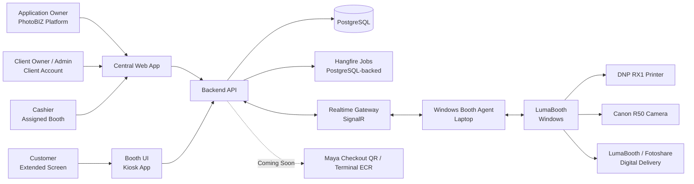
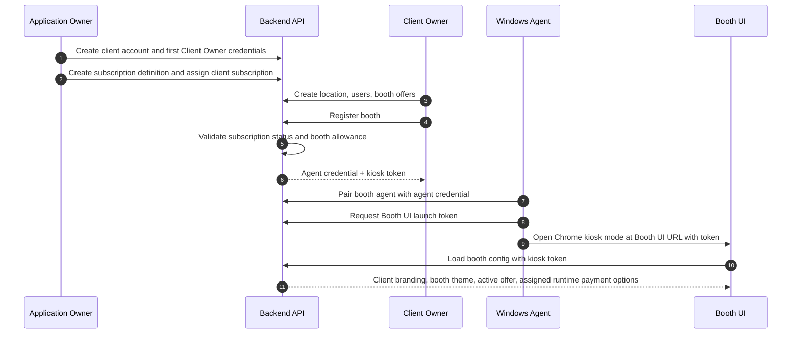
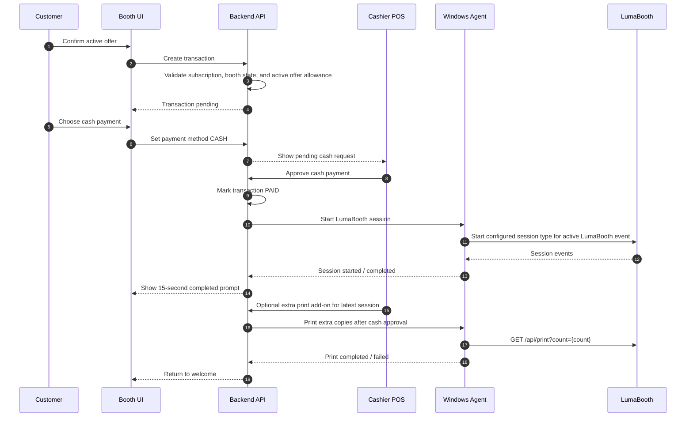
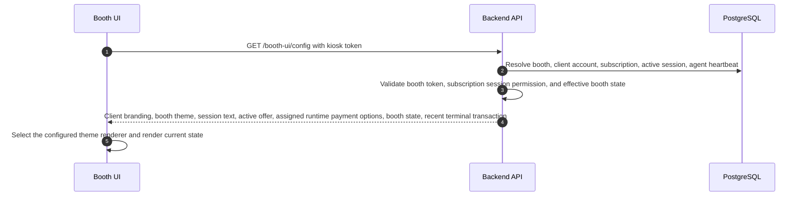
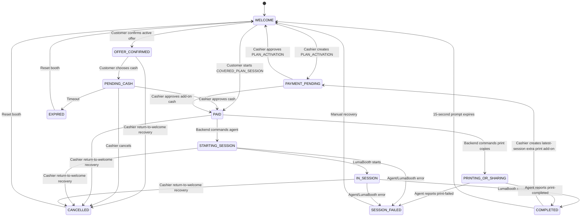
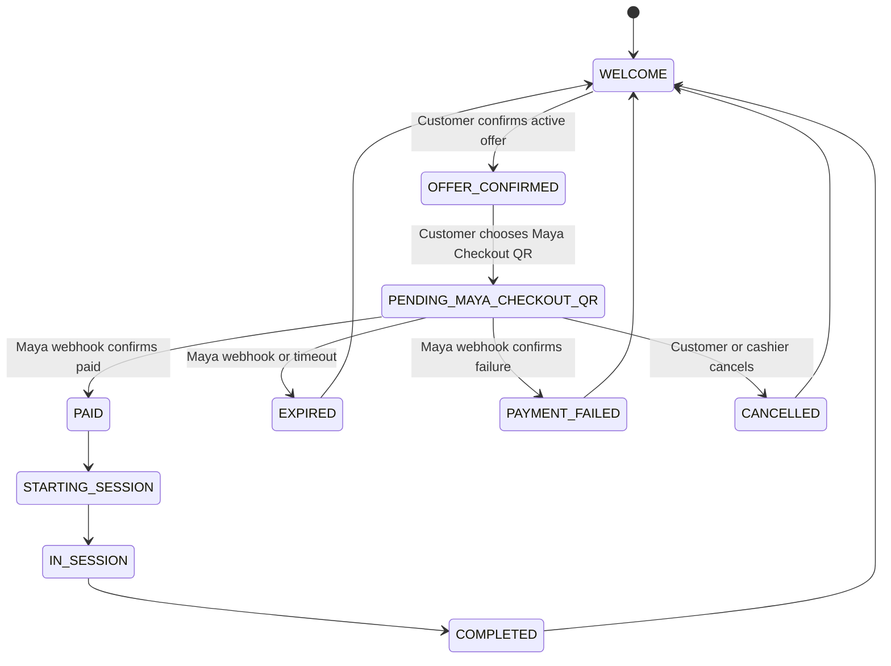
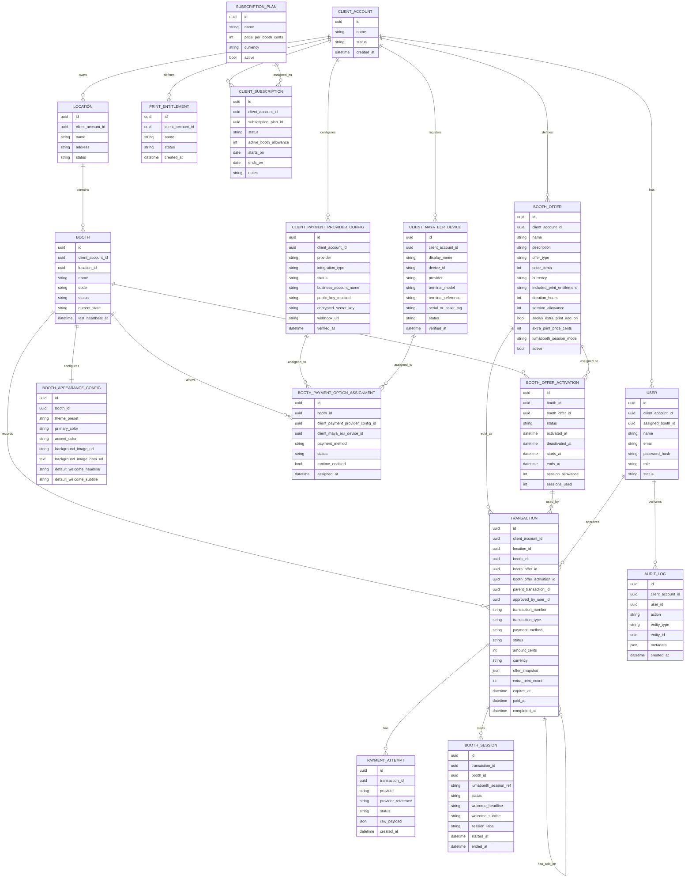
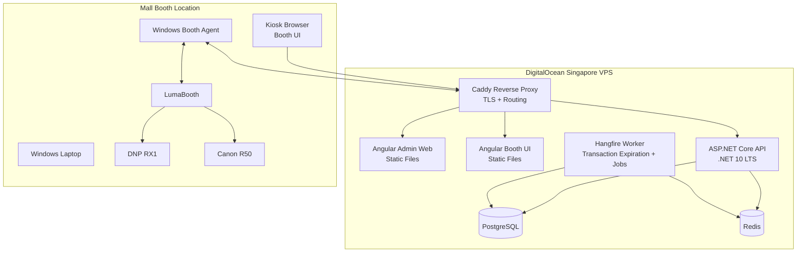

# Architecture And Diagrams

## Overview

This document is the source of truth for the PhotoBIZ platform architecture. Future implementation work must follow the decisions, boundaries, state machines, and phases defined here unless this document is explicitly updated. If another project document conflicts with this file, this file takes precedence.

PhotoBIZ is a multi-tenant SaaS platform. The Application Owner manages client accounts and manual subscriptions. Client users manage their own locations, booths, booth offers, sessions, cashier workflows, and reports. Booth UI and Windows Agent clients operate within one paired booth and one client account.

The platform has three primary runtime surfaces:

1. Central Web App: used by Application Owner, Client Owner, Client Admin, and Cashier users.
2. Booth UI: customer-facing screen on the booth's extended monitor.
3. Windows Booth Agent: local process on the booth laptop that controls LumaBooth integration.

The backend owns tenant isolation, subscription enforcement, transaction state, payment state, and booth commands.

## High-Level System Diagram



## Tenant And Subscription Flow



## MVP Runtime Flow



## Booth UI Config Flow



Booth UI token access is separate from Windows Agent availability. A valid kiosk token may still load Booth UI config when the agent is closed, but the backend treats the booth as `OFFLINE` when the booth has no agent heartbeat or the last heartbeat is older than 60 seconds. While effective booth state is `OFFLINE`, Booth UI must show an agent-offline unavailable state and the backend must reject new kiosk transactions.

Booth registration issues one-time booth credentials. Because raw credentials are not stored after issue, Admin Web can re-issue credentials from Manage Booth; re-issue rotates both the Agent credential and kiosk token and invalidates the previous Agent credential. On startup, an authenticated Windows Agent identifies the booth by configured booth code plus Agent credential, requests a fresh booth-scoped kiosk token from `/api/agent/booth-ui-launch`, then launches Chrome in kiosk mode at the configured Booth UI URL with the token in the first path segment, for example `http://localhost:4201/{token}`. The Agent uses an isolated Chrome user data directory for kiosk launches so an existing normal Chrome profile/window cannot downgrade the launch into a browser with address-bar controls.

The backend also enforces one active kiosk transaction per booth. A booth must not create a new session purchase while another transaction for that booth is still in a non-terminal state such as `CREATED`, `PENDING_CASH`, `PAID`, `STARTING_SESSION`, `IN_SESSION`, or `SESSION_FAILED`. Cashier manual recovery through `return-to-welcome` resolves that inconsistency by cancelling the active booth transaction and returning the booth to `WELCOME`.

Minimum `GET /booth-ui/config` response shape:

```json
{
  "client": {
    "displayName": "The Memory Box",
    "logoUrl": null
  },
  "theme": {
    "preset": "VINTAGE",
    "primaryColor": "#4f2d1d",
    "accentColor": "#f5d27e",
    "backgroundImageUrl": null,
    "backgroundImageDataUrl": "data:image/png;base64,...",
    "fontMode": "serif"
  },
  "session": {
    "label": "SM Manila - Vintage Summer",
    "welcomeHeadline": "Step Into The Memory Box",
    "welcomeSubtitle": "Review today's booth offer, pay at the counter, then strike your best pose."
  },
  "booth": {
    "id": "booth-id",
    "state": "WELCOME"
  },
  "activeOffer": {
    "id": "offer-id",
    "name": "Per Session",
    "type": "PER_SESSION",
    "priceCents": 25000,
    "currency": "PHP",
    "includedPrintEntitlement": "2 pcs 6x2 or 1 pc 6x4",
    "allowsExtraPrintAddOn": true,
    "extraPrintPriceCents": 5000,
    "activationStatus": "ACTIVE",
    "startsAt": null,
    "endsAt": null,
    "sessionAllowance": null,
    "sessionsUsed": 0
  },
  "paymentOptions": [
    {
      "method": "CASH",
      "label": "Cash",
      "runtimeEnabled": true
    }
  ],
  "recentTransaction": null
}
```

If no active offer is configured for the booth, `activeOffer` is `null`, `paymentOptions` is empty, and Booth UI must show an unavailable state. Runtime payment options are filtered from booth-level payment assignments, not client-level payment setup alone. In MVP, `CASH` is the only payment method that can be returned with `runtimeEnabled: true`.

For non-per-session packages, Manage Booth selection and paid activation are separate. Selecting a `TIME_UNLIMITED` or `SESSION_COUNT` package creates a booth offer activation with `PENDING_PAYMENT`; Booth UI returns that package in `activeOffer` with `activationStatus: "PENDING_PAYMENT"`, empty `paymentOptions`, and customer-facing cashier messaging. Cashier POS creates a cash-only `PLAN_ACTIVATION` transaction through `POST /api/cashier/booths/{boothId}/plan-activation`. Cash approval marks the activation `ACTIVE`, starts `startsAt`/`endsAt` for timed plans or resets the session allowance counter for session-count plans, and does not emit an Agent command. Active paid timed/session-count packages create zero-amount `COVERED_PLAN_SESSION` transactions from the existing Booth UI transaction route; those transactions are the ones that command the Agent to start LumaBooth.

The Booth UI completed prompt is package-aware. `PER_SESSION` completed sessions may show the extra-print cashier prompt and a `No Extra Prints` action that posts to `/api/booth-ui/return-to-welcome`. Booth UI also starts its own 15-second completed-prompt timer and calls the same return path when the timer wins. The return path is de-duplicated. Timer-triggered return failures retry quietly; customer button-triggered failures must show a clear error while staying on the completed screen and retrying. Booth UI must not locally fake `WELCOME` while the API still reports `COMPLETED`; it stays on the completed screen until the backend command succeeds or config reports `WELCOME`. The endpoint is kiosk-token scoped and idempotently returns the booth to `WELCOME` for the latest completed session when no newer active booth transaction exists, so old failed history does not block it and it remains safe if the worker has already auto-reset the booth. `TIME_UNLIMITED` and `SESSION_COUNT` completed sessions must show normal completion copy only, because extra print add-ons are not valid for covered-plan sessions.

`recentTransaction` is populated only for short-lived customer-facing terminal outcomes such as `CANCELLED`, `EXPIRED`, or `PAYMENT_FAILED`. Booth UI uses it to show a clear recovery screen after cashier cancellation, payment failure, or payment expiration even when the booth has already reset to `WELCOME`.

Booth themes are PhotoBIZ-owned presets: `VINTAGE`, `CLEAN_MODERN`, and `POP`. The shared Booth UI stage selects a preset-specific Angular presentation component instead of accepting arbitrary tenant CSS or ad hoc color inputs. Theme colors, typography, and button styling come from the selected preset. Booth-level background images are optional uploads stored as constrained PNG/JPEG/WebP data URLs, with backend size/type validation.

## LumaBooth Integration Constraints

- Each booth machine runs one active LumaBooth event/configuration at a time.
- PhotoBIZ does not switch LumaBooth templates or event configuration per customer transaction in MVP.
- LumaBooth owns capture, templates, printing, and Fotoshare delivery.
- PhotoBIZ owns the commercial offer, payment, usage allowance, add-on eligibility, session state, and audit trail.
- The Windows Agent may start the configured LumaBooth session type and may request additional print copies where the LumaBooth API supports it.
- The Agent supports `Simulator` and `Api` integration modes. `Api` mode starts sessions with the local dslrBooth/LumaBooth API at `GET /api/start?mode={mode}&password={password}`.
- Post-session extra print add-ons use the local LumaBooth API at `GET /api/print?count={count}`. If an API password is configured locally, the Agent appends `password={password}`.
- The Agent exposes a local loopback trigger listener, defaulting to `http://127.0.0.1:5617/lumabooth/events`, for LumaBooth URL trigger callbacks.
- Canonical session modes are `PRINT`, `GIF`, `BOOMERANG`, and `VIDEO`; legacy `SESSION_STANDARD` is normalized to `PRINT`.
- `session_start` trigger events become backend session-started callbacks. `session_end` trigger events become backend session-completed callbacks. Non-terminal events such as `printing`, `file_upload`, and `sharing_screen` are logged for operations.
- The Agent stores the active transaction context locally so trigger events can be correlated to the backend transaction.
- The Agent brings LumaBooth foreground after a successful start and restores Booth UI/browser after `session_end`. Focus failures are warnings.
- LumaBooth API credentials live only in local Agent configuration.

Agent command payload. `command` is `START_SESSION` for normal capture sessions and `PRINT_COPIES` for paid extra print add-ons:

```json
{
  "transactionId": "uuid",
  "transactionNumber": "PBZ-20260516-0001",
  "command": "START_SESSION",
  "lumaboothSessionMode": "PRINT",
  "offerType": "PER_SESSION",
  "transactionType": "SESSION_PURCHASE",
  "includedPrintEntitlement": "TWO_BY_SIX_OR_ONE_BY_FOUR",
  "extraPrintCount": 0
}
```

Agent session callbacks may include `lumaboothSessionRef`, `lumaboothEventType`, and failure `reason`.

Agent configuration keys:

- `PhotoBIZ:LumaBooth:Mode`
- `PhotoBIZ:LumaBooth:ApiBaseUrl`
- `PhotoBIZ:LumaBooth:ApiPassword`
- `PhotoBIZ:LumaBooth:TriggerListenerUrl`
- `PhotoBIZ:LumaBooth:StartTimeoutSeconds`
- `PhotoBIZ:Display:LumaBoothWindowTitle`
- `PhotoBIZ:Display:BoothUiWindowTitle`
- `PhotoBIZ:Display:BoothUiBaseUrl`
- `PhotoBIZ:Display:ChromeExecutablePath`
- `PhotoBIZ:Display:ChromeUserDataDir`
- `PhotoBIZ:Display:LaunchBoothUiOnStartup`
- `PhotoBIZ:Display:KioskMode`

Payment setup has two levels:

- Client-level resources register one Maya Checkout QR configuration and multiple Maya Terminal ECR device configurations.
- Booth-level assignments choose which registered payment resources are allowed on each booth.
- Maya Checkout QR assignment requires the client Maya QR resource to exist and be active or verified.
- Maya Terminal ECR assignment requires selecting a specific active client ECR `deviceId`.
- Future payment option values are `MAYA_CHECKOUT_QR` and `MAYA_TERMINAL_ECR`, but they remain locked until the provider integrations are enabled in a future phase.

## Cash Payment State Flow



## Coming Soon Maya Checkout QR Flow



## Coming Soon Maya Checkout QR Runtime Flow


## Application Boundaries

### Central Web App

Stack:

- Angular 21.
- TypeScript.
- Angular Material.

Responsibilities:

- Authentication screens.
- Application Owner platform dashboard.
- Client account management.
- Application Owner client onboarding, including first Client Owner credential creation.
- Subscription catalog and client subscription assignment management.
- Client Owner dashboard.
- Cashier POS view.
- User management.
- Location management.
- Booth management.
- Booth offer management.
- Booth UI theme/session appearance management.
- Client payment resource setup and booth payment option assignment.
- Transaction monitoring.
- Reports.
- Audit logs.

The Admin Web consumes `/api/admin/overview` as the MVP operations read model. The response is scoped by role and includes setup lists, recent transactions, report summaries, and recent audit events. Recent dashboard and Cashier POS history surfaces present these records as booth activity, grouping paid sales separately from session usage so zero-amount `COVERED_PLAN_SESSION` rows display as included covered sessions rather than PHP 0 sales. Session-count covered-session activity rows use a historical sequence number for that transaction, so older rows do not repeat the activation's current `sessionsUsed` total. The dashboard Booth Status list also shows package context: session-count packages display the latest completed covered-session sequence and timed packages display minutes remaining plus the exact expiration time in Philippine time. The full Transactions page remains the ledger-style transaction view. Application Owner navigation is limited to Dashboard, Subscriptions, Clients, and subscription-focused Audit Log views. The Application Owner Subscriptions page is the reusable subscription catalog (`SubscriptionPlan`) with per-booth monthly pricing; client subscription assignment/status/allowance changes stay on client account workflows. Client Owner and Client Admin navigation is scoped to their tenant operations: Dashboard, Users, Locations, Booths, Packages, Transactions, Reports, Settings, and Audit Log. Packages are the client-facing UI label for booth offers and include the tenant-scoped print entitlement list used by package creation/editing. Cashiers receive only their assigned booth, assigned-booth transactions, assigned-booth report rows, and their own audit events.
Client owners and client admins may create cashier users before booth assignment; the actual cashier-to-booth link is set during booth registration in the Admin Web flow. Cashier operational permissions are stored on the user record and returned through the session and overview APIs. Admin Web user detail management edits the cashier permission flags for approving cash, cancelling transactions, and returning the assigned booth to welcome. Backend cashier endpoints enforce those flags for cashier users; Client Owner/Admin roles continue to rely on role-based authorization for the same operational recovery paths.
The Admin Web Booths page is an inventory table, not an inline operations panel. Manage Booth is the only setup surface for booth record edits, cashier reassignment, active package selection, cash payment assignment, and Booth UI appearance. The detail surface uses two tabs: Details for booth record, assigned cashier, active package, and payment setup; Session Setup for session copy, theme preset, background image upload, and preview. `/api/admin/overview` includes tenant-scoped booth appearance summaries so the detail page can load current appearance without calling the kiosk-token endpoint. Booth updates may change the assigned cashier, but the backend must enforce same-tenant users, `CASHIER` role, and one booth per cashier.

### Booth UI

Stack:

- Angular web app running in browser kiosk mode on the booth laptop's extended customer-facing screen.

Responsibilities:

- Authenticate with booth-scoped kiosk token.
- Load client branding, booth theme, and session config from backend.
- Select the configured shared theme component (`VINTAGE`, `CLEAN_MODERN`, or `POP`) and render the state.
- Display welcome screen.
- Display the booth's active offer.
- Let customer select only booth-assigned runtime-enabled payment methods for payable per-session flows.
- Display pending payment state.
- Display cash waiting state for MVP.
- Display expiration/error states.
- Return to welcome when backend state allows.

Rules:

- Booth UI must not require cashier login during daily use.
- Booth UI must not directly approve payment or start LumaBooth.
- Booth UI must not accept arbitrary CSS or script customization.
- Booth UI and Admin Web preview must use the same pure stage presentation component and the same effective config shape as `GET /api/booth-ui/config`. Admin preview may hide kiosk-only token controls, but must share theme-specific layout, state visuals, offer rendering, and button styling with the kiosk app.

### Backend API

Stack:

- ASP.NET Core on .NET 10 LTS.
- PostgreSQL.
- Redis for realtime backplane, cache, and distributed locks.
- SignalR for realtime updates.
- Entity Framework Core for database access.
- Hangfire with PostgreSQL storage for background jobs and transaction expiration.

Responsibilities:

- Authentication and authorization.
- Tenant isolation.
- Role-based access control.
- Client account APIs.
- Subscription definition and client subscription assignment APIs.
- Client/location/booth/user/booth-offer APIs.
- Client payment resource and booth payment option assignment APIs.
- Booth UI config API.
- Transaction state machine.
- Payment orchestration.
- Maya Checkout QR provider integration during Phase 5.
- Maya Terminal ECR provider integration during Phase 5.
- Agent command dispatch.
- Realtime updates to Booth UI and Cashier POS.
- Reporting.
- Audit logging.

The MVP reporting read model includes active/offline booth counts, subscription status counts, manual MRR estimate, clients over allowance, today's gross/cash sales, today's completed sessions, pending cash count, failed/expired count, and booth/location/offer sales summaries. These summaries are backend-computed from tenant-scoped data; Admin Web only renders them.

### Windows Booth Agent

Stack:

- .NET 10 LTS.
- Windows Service.

Responsibilities:

- Pair with backend booth record.
- Maintain heartbeat.
- Listen for start-session commands.
- Call LumaBooth through simulator or local API mode.
- Receive LumaBooth URL trigger events through the local loopback listener.
- Report session state.
- Manage local recovery.
- Manage Booth UI and LumaBooth app/window focus on the booth laptop.
- Request fresh Booth UI kiosk launch tokens and open Chrome in kiosk mode for the customer-facing Booth UI.

## Repository Structure

```text
photobooth-platform/
  apps/
    admin-web/
      src/
    booth-ui/
      src/
  services/
    api/
      src/
  agent/
    windows-agent/
      src/
  docs/
    PRD.md
    ARCHITECTURE.md
```

## Data Model



## Transaction State Machine Rules

Only the backend may transition transactions between states.

Allowed MVP transitions:

```text
CREATED -> PENDING_CASH
PENDING_CASH -> PAID
PENDING_CASH -> EXPIRED
PENDING_CASH -> CANCELLED
PAID -> STARTING_SESSION
STARTING_SESSION -> IN_SESSION
PAID -> CANCELLED
STARTING_SESSION -> SESSION_FAILED
STARTING_SESSION -> CANCELLED
IN_SESSION -> COMPLETED
IN_SESSION -> SESSION_FAILED
IN_SESSION -> CANCELLED
SESSION_FAILED -> CANCELLED
```

Rules:

- Booth UI cannot mark transactions as paid.
- A booth may have at most one non-terminal session transaction at a time.
- Cashier `return-to-welcome` recovery cancels the booth's active non-terminal transaction so the booth can accept a new session purchase.
- Payment method selection must be validated against booth-level payment option assignments and runtime provider availability.
- Client-level Maya configuration alone cannot expose a payment method to Booth UI or Cashier POS.
- `CASH` is the only runtime-enabled payment method in MVP.
- Cashiers can approve only transactions for their assigned booth.
- Application Owner can manage clients/subscriptions but does not normally approve client booth transactions.
- Expired transactions release the booth.
- Session transactions snapshot the active booth offer and active offer assignment.
- Extra print add-on transactions must reference the latest completed `PER_SESSION` parent transaction for the same booth and do not start a new capture session.
- Extra print add-ons are cashier/POS-only, cash-only in MVP, and support 1 to 5 copies.
- Paid extra print add-ons dispatch `PRINT_COPIES` to the Windows Agent and must not create a `BOOTH_SESSION` row.
- Extra print add-ons are rejected for `TIME_UNLIMITED` and `SESSION_COUNT` offer transactions.
- Completed transactions are immutable except for administrative notes or future refund records.

## Realtime Channels

Channels:

- `platform:dashboard`
- `client:{clientAccountId}:dashboard`
- `booth:{boothId}:state`
- `booth:{boothId}:commands`
- `cashier:{userId}:notifications`
- `location:{locationId}:dashboard`

Realtime events:

- `client.subscription.changed`
- `booth.state.changed`
- `transaction.created`
- `transaction.payment_pending`
- `transaction.paid`
- `transaction.expired`
- `transaction.cancelled`
- `transaction.add_on_created`
- `transaction.add_on_paid`
- `session.starting`
- `session.started`
- `session.completed`
- `session.failed`
- `agent.heartbeat`
- `agent.offline`

## Deployment Architecture

The hosting plan is documented in [Hosting And Deployment Plan](DEPLOYMENT.md).

MVP deployment:

- DigitalOcean Basic Droplet in Singapore.
- Docker Compose.
- Host Angular Admin Web, Angular Booth UI, ASP.NET Core API, PostgreSQL, Redis, and reverse proxy on the same server.
- Deploy through GitHub Actions over SSH.
- Cloudflare DNS.
- VPS backups and nightly PostgreSQL dumps before live use.



## Technology Decisions

- Repository: single repository containing Angular apps, ASP.NET Core API, Windows Agent, and documentation.
- Frontend workspace: one Angular workspace containing two separate applications: `admin-web` and `booth-ui`.
- Shared frontend code lives in Angular workspace libraries for API clients, DTOs, validation helpers, constants, and reusable UI primitives.
- The Booth UI stage renderer is a shared Angular presentation component consumed by both `admin-web` preview and `booth-ui` kiosk rendering to prevent visual drift.
- Admin Web: Angular 21 + TypeScript + Angular Material.
- Booth UI: Angular 21 + TypeScript, optimized for kiosk browser use.
- Backend API: ASP.NET Core on .NET 10 LTS.
- Database: PostgreSQL.
- ORM: Entity Framework Core.
- Realtime: SignalR.
- Background jobs: Hangfire with PostgreSQL storage.
- Cache/locks/backplane: Redis.
- Windows Agent: .NET 10 LTS Windows Service.
- Admin authentication: email/password login with secure HttpOnly cookie sessions.
- Booth UI authentication: booth-scoped kiosk token issued during booth registration or Agent launch. No cashier unlock/login is required to show the Booth UI.
- Agent authentication: booth agent credential issued during pairing.
- Agent availability: the backend treats a booth as `OFFLINE` when the agent has not heartbeated within 60 seconds. Agent heartbeat restores an offline booth to `WELCOME`; kiosk token access remains valid but transaction creation is blocked while offline.
- Hosting: DigitalOcean Singapore VPS using Docker Compose.
- DNS: Cloudflare.
- CI/CD: GitHub Actions deploying over SSH.

## Environment Strategy

Environments:

- `local`: developer machine.
- `production`: live booths.

Each booth is paired to exactly one environment.

## Security Notes

- Store password hashes with a strong hashing algorithm.
- HTTPS is required in production.
- Admin sessions use secure HttpOnly cookies.
- Agent credentials are separate from user credentials.
- Treat booth agents as privileged clients.
- Enforce tenant isolation for all client-scoped data.
- Validate subscription status and booth allowance before activating booths or starting sessions.
- Validate Booth UI theme presets and uploaded background image data URLs.
- Validate booth payment option assignments before creating or advancing payment attempts.
- Reject arbitrary client CSS, scripts, or layout definitions.
- All payment approvals and subscription changes must be audited.
- Cashiers must be scoped to assigned booths.
- Do not trust client-side transaction state.

## Implementation Phases

### Phase 1: MVP Foundations

- Monorepo setup.
- Database schema.
- Auth and roles.
- Client account management.
- Manual subscription management.
- Client user management.
- Location and booth management.
- Booth offer management.
- Active booth offer assignment.
- Minimal tenant Booth UI theme management.
- Booth-level cash payment assignment.
- Client-level draft Maya QR and Maya ECR setup records.

### Phase 2: Transaction And POS

- Booth UI config endpoint.
- Booth UI active offer review.
- Cash transaction flow.
- Cashier approval.
- Cash-only cashier plan activation for time-unlimited and session-count offers.
- Expiration jobs.
- Transaction dashboard.

### Phase 3: Agent And LumaBooth

- Agent pairing.
- Agent heartbeat.
- Backend command dispatch.
- Start LumaBooth session through simulator or local API mode.
- Receive LumaBooth URL trigger events and map terminal events to backend session callbacks.
- Booth state recovery.

### Phase 4: Reporting And Operations

- Application Owner dashboard.
- Client Owner dashboard.
- Cashier booth dashboard.
- Sales reports.
- Subscription health reports.
- Booth status reports.
- Audit logs.

### Phase 5: Coming Soon Real Payments

- Client-owned Maya Checkout QR integration.
- Maya webhook handling.
- Payment reconciliation.
- Maya Terminal ECR integration using booth-assigned client ECR `deviceId` values.

## Architectural Principles

- Backend owns truth.
- Client data is tenant-isolated by `client_account_id`.
- Application Owner manages SaaS clients and subscriptions.
- Client users manage only their own client account.
- Booth UI is a display and input surface, not a payment authority.
- Booth UI customization is config-driven and constrained.
- Agent owns local Windows and LumaBooth integration.
- LumaBooth remains responsible for capture, print, and Fotoshare.
- Booth offer data is snapshotted into transactions.
- Subscription status and booth allowance protect platform access.
