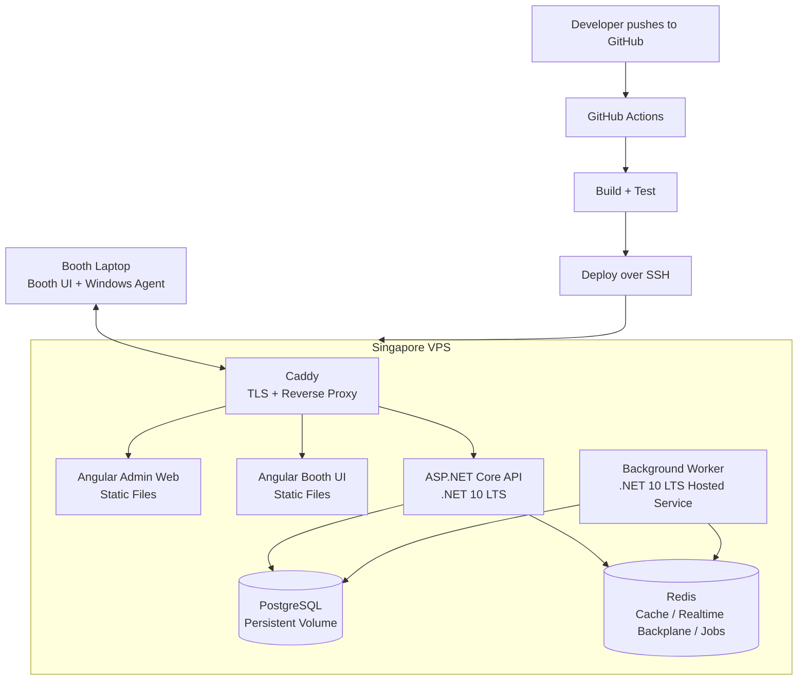

# Hosting And Deployment Plan

## Decision

Use a low-cost Singapore-region VPS for MVP and early production.

The first deployment runs the Angular Admin Web, Angular Booth UI, ASP.NET Core API, PostgreSQL, Redis, and reverse proxy on one VPS using Docker Compose.

Starting provider:

- DigitalOcean Droplet, Singapore region, Basic 2 GB RAM / 1 vCPU / 50 GB SSD.

Minimum production setup:

- One VPS.
- Docker Compose.
- Caddy reverse proxy.
- PostgreSQL container with persistent volume.
- Redis container with persistent volume or ephemeral cache depending on implementation.
- Cloudflare DNS in front of the domain.
- Automated VPS backups enabled.
- Off-server PostgreSQL backups copied to object storage or another backup location.

This keeps starting cost low while keeping deployment understandable and CI/CD friendly.

## Why This Hosting Model

The product needs a long-running backend API with SignalR/WebSocket connections from booth agents and browser clients. This makes a normal VPS or container host a better starting point than serverless hosting.

The MVP will have low traffic. The expensive part of the business is the physical booth, not cloud load. A single properly backed-up VPS is enough for one booth and likely enough for the first few booths.

## Estimated Starting Cost

Approximate monthly cost:

```text
DigitalOcean 2 GB Droplet:      about $12/month
Weekly Droplet backups:         about 20% of Droplet cost
Cloudflare DNS:                 free plan is enough
GitHub Actions:                 usually covered by included free minutes at this stage
Domain name:                    separate yearly cost
```

Expected MVP hosting cost: about $15/month plus domain cost.

Use a 4 GB RAM VPS when:

- Build/deploy memory becomes tight.
- PostgreSQL grows.
- More booths connect.
- The API, database, and Redis start competing for memory.

## Deployment Architecture



## Domains

Use subdomains from the start:

```text
admin.yourdomain.com      PhotoBIZ SaaS, client admin, and cashier web app
booth.yourdomain.com      Customer-facing booth UI
api.yourdomain.com        Backend API and SignalR
```

For local booth configuration, each booth stores:

- API base URL.
- Booth ID or booth code.
- Booth UI kiosk token issued during booth pairing.
- Agent pairing credential.
- Environment name: local or production.

## CI/CD Plan

Use GitHub Actions.

### Pull Request Pipeline

Runs on every pull request:

- Restore dependencies.
- Build Angular Admin Web.
- Build Angular Booth UI.
- Build ASP.NET Core API.
- Run frontend tests.
- Run backend tests.
- Run lint/format checks.
- Do not deploy.

### Production Pipeline

Runs on merge to `main`:

1. Build and test all projects.
2. Publish Angular Admin Web static build.
3. Publish Angular Booth UI static build.
4. Publish ASP.NET Core API.
5. Copy deployment artifact to VPS over SSH.
6. Run database migrations.
7. Restart Docker Compose services.
8. Run smoke checks against:
   - `https://admin.yourdomain.com`
   - `https://booth.yourdomain.com`
   - `https://api.yourdomain.com/health`

Production deployments should use GitHub Environments with manual approval once real booths are active.

## Docker Compose Services

Expected services:

```text
reverse-proxy
api
worker
postgres
redis
```

The Angular apps can be served either:

- As static files mounted into the reverse proxy container.
- Or as small static-site containers.

For MVP, serving static files through Caddy is simpler and cheaper.

## Backup Requirements

Backups are mandatory before any live booth accepts real payments.

Minimum backup setup:

- VPS provider weekly backup.
- Nightly PostgreSQL dump.
- Keep at least 7 daily database backups.
- Copy database backups off-server.
- Test restore before launch.

Later backup setup:

- Managed PostgreSQL with automated backups.
- Point-in-time recovery.
- Object storage for exported reports and optional assets.

## Scaling Plan

### Stage 1: MVP / First Booth

Use one 2 GB VPS.

Run everything on the same server:

- Angular static files.
- ASP.NET Core API.
- PostgreSQL.
- Redis.
- Background worker.

### Stage 2: First Few Booths

Upgrade to one 4 GB VPS or move PostgreSQL to a managed database.

Upgrade trigger:

- More than 3-5 active booths.
- Frequent production deployments.
- Database backups/restores become operationally important.
- Memory pressure on the VPS.

### Stage 3: Multi-Location Operations

Move to managed services:

- App host for ASP.NET Core API.
- Managed PostgreSQL.
- Managed Redis or Redis-compatible service.
- Separate production infrastructure from local development.

Good candidates:

- DigitalOcean App Platform + Managed PostgreSQL.
- Azure App Service + Azure Database for PostgreSQL + Azure SignalR.
- AWS ECS/App Runner + RDS PostgreSQL + ElastiCache.

### Stage 4: SaaS Scale

Use a more managed and redundant architecture:

- Multiple API instances.
- Load balancer.
- Managed PostgreSQL with point-in-time recovery.
- Redis backplane or managed SignalR.
- Centralized logging.
- Error monitoring.
- Infrastructure as code.

## Why Not Start With Managed PaaS

Managed PaaS options are easier operationally but usually cost more once the API, database, Redis, background workers, and static sites are counted separately.

For this product, the MVP needs to preserve cash while the booth business model is validated. A VPS gives the lowest predictable monthly bill.

Move to managed services when uptime, backup guarantees, and operational simplicity become more valuable than the extra monthly cost.

## Notes On GitHub Actions Cost

GitHub Actions should be enough for MVP if the repository is small and builds are not excessive.

Use these cost controls:

- Run full deployment only on `main`.
- Run normal CI on pull requests.
- Cache NuGet and npm dependencies.
- Avoid building Docker images for every branch unless needed.
- Use manual production approval once booths are live.

## Initial Recommendation

Start with:

- DigitalOcean Basic Droplet, Singapore, 2 GB RAM.
- Docker Compose.
- Caddy reverse proxy.
- PostgreSQL and Redis on the same VPS.
- Cloudflare DNS.
- GitHub Actions deploy over SSH.
- Weekly VPS backups plus nightly PostgreSQL dumps.

This is the best balance of low cost, straightforward CI/CD, and enough control for a .NET + SignalR + Angular + Windows Agent product.
