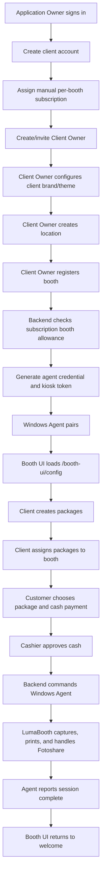

# UI Workflow Mockups

This document maps the PhotoBIZ PRD functionality to UI mockup screens.

The source mockups live in `ui-mockups.html`. Screenshots in `screenshots/` may be stale unless explicitly regenerated; do not generate screenshots unless requested.

## Central Web App Coverage

| Functionality | Mockup section id |
| --- | --- |
| Login | `central-login` |
| Application Owner platform dashboard | `platform-dashboard` |
| Client accounts list | `client-accounts` |
| Client account detail | `client-account-detail` |
| Manual subscription editor | `subscription-editor` |
| Client Owner dashboard | `central-dashboard` |
| Client user management | `users-list` |
| Add/edit client user | `user-form` |
| Locations and booth inventory | `locations-booths` |
| Register booth | `booth-register` |
| Booth detail, health, recovery, and end booth | `booth-detail` |
| Package catalog | `packages-management` |
| Package editor and booth assignment | `package-editor` |
| Client Booth UI branding and session appearance | `booth-customization` |
| Transactions, reports, and audit activity | `transactions-reporting` |
| Payment/session settings | `settings-payments` |
| Coming soon Maya Checkout registration | `maya-checkout-registration` |
| Coming soon Maya Terminal ECR registration | `maya-ecr-registration` |
| Cashier POS | `cashier-pos` |

## Booth UI Coverage

| Functionality | Mockup section id |
| --- | --- |
| Client A welcome, vintage theme | `client-a-booth-welcome` |
| Client A package selection, vintage theme | `client-a-booth-packages` |
| Client A payment preview, vintage theme | `client-a-booth-payment` |
| Client B welcome, modern pop theme | `client-b-booth-welcome` |
| Client B package selection, modern pop theme | `client-b-booth-packages` |
| Client B payment preview, modern pop theme | `client-b-booth-payment` |
| Cash waiting screen | `booth-cash-waiting` |
| Payment approved / starting LumaBooth | `booth-starting-session` |
| LumaBooth session in progress / handoff | `booth-session-progress` |
| Session complete | `booth-session-complete` |
| Error and recovery | `booth-error-recovery` |

## End-To-End SaaS Workflow

## Client Subscription Setup Checklist

1. Application Owner creates a client account.
2. Application Owner creates or assigns a subscription plan.
3. Application Owner sets subscription status and active booth allowance.
4. Application Owner creates or invites the first Client Owner.
5. Client Owner signs in and configures client branding.
6. Client Owner creates locations, users, packages, and booths.

## Booth Registration To Live Checklist

1. Client Owner or Client Admin creates or confirms the location.
2. Client Owner or Client Admin registers the booth with name, code, location, assigned cashier, camera, and printer.
3. Backend validates client subscription status and active booth allowance.
4. System creates agent pairing credential and Booth UI kiosk token.
5. Technician installs and pairs the Windows Agent on the booth laptop.
6. Booth UI opens using the booth-scoped kiosk token.
7. Client assigns active packages to the booth.
8. Client configures client theme and active session text.
9. Booth status becomes online and ready.

## Customer Session Checklist

1. Booth UI loads client theme and active session config.
2. Booth UI shows the welcome screen.
3. Customer taps start.
4. Customer chooses one of the assigned packages.
5. Customer chooses Cash payment.
6. Backend creates a pending transaction.
7. Cashier POS receives the pending payment.
8. Cashier approves cash.
9. Backend marks transaction as paid.
10. Backend commands Windows Agent to start LumaBooth.
11. LumaBooth completes photo capture, print, and Fotoshare.
12. Agent reports completion.
13. Backend marks transaction completed.
14. Booth UI returns to welcome.

## Coming Soon Maya Setup Screens

These mockups document future setup flows only. They do not enable live cashless payments in the MVP.

Maya Checkout QR setup:

1. Client Owner opens `maya-checkout-registration`.
2. Client reviews Business Account, API Keys, Webhook, Verification, and Ready steps.
3. Client enters Maya Business account name, public API key, and masked secret API key.
4. Client copies the PhotoBIZ webhook URL into Maya Business Manager.
5. `MAYA_CHECKOUT_QR` remains locked until future verification support is implemented.

Maya Terminal ECR setup:

1. Client Owner opens `maya-ecr-registration`.
2. Client reviews Terminal Ordered, ECR Kit Received, Booth Assigned, COM Port Set, and Connection Test steps.
3. Client drafts terminal model/reference, serial or asset tag, booth assignment, and Windows COM port.
4. `MAYA_TERMINAL_ECR` remains locked until Maya terminal hardware and Windows Agent ECR support are implemented.

## Ending A Booth

Ending a booth means taking a booth out of service while preserving historical transactions.

Flow:

1. Client Owner or Client Admin opens Booth Detail.
2. User confirms no active customer session is in progress.
3. User disables new sessions.
4. User clicks `End Booth`.
5. System revokes agent and Booth UI kiosk credentials.
6. Booth status changes to inactive/unregistered.
7. Active booth usage is reduced for subscription allowance.
8. Audit log records the action.
9. Historical transactions remain visible in reports.
